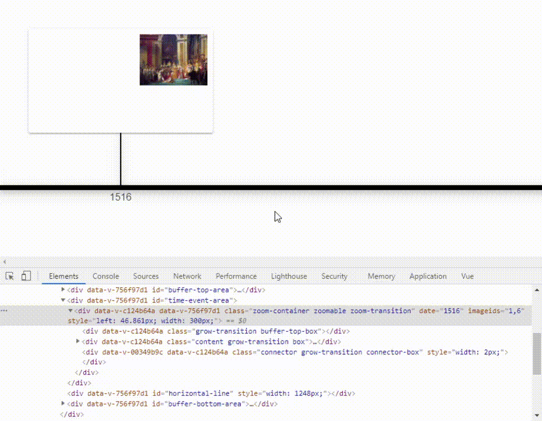

# Developer blog
## How does space emerge?
_December 27, 2020_

No, we won't talk about science here, although on my way to solving this, I sometimes felt I am dealing with rocket science here.

If you read my previous blog post on [how I implemented zoom](../how-zoom), you might remember that our boxes (time events) will move away from the mouse pointer as we spin the scroll wheel of the mouse. This poses a problem with how browsers handle absolute positioning of elements.

### What happens? ###
Those boxes parting to the right will be fine. The browser will display a bottom scrollbar and you can reach those boxes using horizontal scroll. But those boxes parting to the left will vanish in unreachable space as they cross position 0 and enter negative absolute space. As you can see in below example, there is no scrollbar allowing us to reach the partly hidden box. 

Browsers have a reason for not displaying content that resides in the negative space:
(research)

### New (positive) space has to emerge! ###

To solve this issue, the application will have to continuously watch for boxes entering the negative space and unnoticably reposition the whole scene in a way that places all the boxes in the positive space. Here is how it should look:

